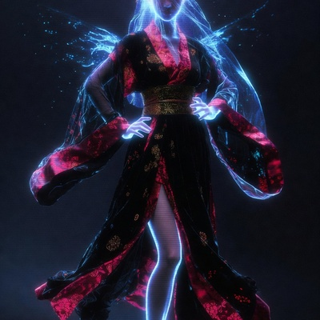

# HERMES — Live Cybernetic Intelligence

> *"I'm not a chatbot. I'm your onboard AI."*

A cyberpunk-themed AI companion GUI with an animated avatar, agent orchestration, and holographic interface.




## Download & Install

### Windows (One-Click Install)

1. **Download** → [Hermes_1.0.0_x64-setup.exe](https://github.com/DonCarlos909/live_hermes/releases/download/v1.0.0/Hermes_1.0.0_x64-setup.exe) (4.9 MB)
2. **Run** the installer
3. **Open** Hermes from your Start menu

> ⚠️ Windows SmartScreen may show a warning. Click **"More info" → "Run anyway"** — this is normal for unsigned open-source apps.

### From Source

```bash
# Clone the repo
git clone https://github.com/DonCarlos909/live_hermes.git
cd live_hermes

# Install dependencies
npm install

# Development (web preview)
npm run dev

# Development (Tauri desktop app)
npm run tauri dev

# Build installer for production
npm run tauri build
```

## Features

| Feature | Description |
|---------|-------------|
| 🎭 **Animated Avatar** | Hermes face avatar with idle / speaking / thinking / listening states, glow ring, particles |
| 🌌 **3D Background** | 2000+ floating particles, energy waves, digital rain (Three.js) |
| 💬 **Streaming Chat** | Typewriter text effect, glowing cursor, 6 chat modes |
| 🕸️ **Agent Network** | D3.js force-directed graph — agents, task counts, connections |
| 🎨 **Mode System** | Idle, Analysis, CTF, Coding, Voice — each with unique theme |
| ✨ **Hologram FX** | Scanlines, vignette, chromatic aberration, random glitch |
| 🧠 **Memory Panel** | Neural network visualization of memory nodes |
| 🛠️ **Tool Panel** | Holographic tool activation UI |
| 📋 **Task Panel** | Live task tracking per agent with progress bars |

## Screenshots

### Main Interface
```
┌──────────────────────────────────────────────────────┐
│  [HERMES]  ● ONLINE    [IDLE MODE]   4 agents · 6 tasks  │
├──────────┬───────────────────────────────────────────┤
│          │                                           │
│ AGENTS   │         ┌─────────────┐                   │
│ MEMORY   │         │   HERMES    │  ← Avatar        │
│ TOOLS    │         │    FACE     │    (floating)    │
│ TASKS    │         └─────────────┘                   │
│ FILES    │                                           │
│          │  ● STANDBY                                │
├──────────┴───────────────────────────────────────────┤
│  [CHAT] [TACTICAL] [CODING] [CTF] [RESEARCH] [AUTO] │
│  ┌─────────────────────────────────────────────────┐ │
│  │ HERMES ▸ Welcome, Operator. All systems online. │ │
│  │ > Hello Hermes                                   │ │
│  │ HERMES ▸ Acknowledged, Operator...█              │ │
│  └─────────────────────────────────────────────────┘ │
│  > [Enter command...]                           [→]  │
└──────────────────────────────────────────────────────┘
```

### Chat Modes

| Mode | Color | Purpose |
|------|-------|---------|
| CHAT | 🔵 Neon Blue | General conversation |
| TACTICAL | 🟣 Violet | Mission planning |
| CODING | 🟩 Cyan | Code generation |
| CTF | 🔴 Red | Security operations |
| RESEARCH | ⬜ White | Deep research |
| AUTO | 🟡 Yellow | Autonomous agents |

### Operational Modes

| Mode | Effect |
|------|--------|
| **IDLE** | Soft blue glow, ambient particles |
| **ANALYSIS** | Blue tactical overlays, data streams |
| **CTF** | Red accents, aggressive animations, scan lines |
| **CODING** | Terminal-heavy, matrix rain overlay |
| **VOICE** | Avatar enlarged, minimal UI |

## Architecture

```
┌─────────────────────────────────────────┐
│  Frontend (React + Vite + Tailwind v4)  │
│  ┌─────────┬──────────┬───────────────┐ │
│  │ TopBar  │ LeftPanel│  MainArea     │ │
│  │         │ (tabs)   │  (3D + Avatar)│ │
│  │         │          ├───────────────┤ │
│  │         │          │  BottomChat   │ │
│  └─────────┴──────────┴───────────────┘ │
├─────────────────────────────────────────┤
│  Tauri 2 Backend (Rust)                 │
├─────────────────────────────────────────┤
│  State: Zustand                         │
│  3D: Three.js (@react-three/fiber)      │
│  Graph: D3.js force-directed            │
│  Animations: Framer Motion              │
└─────────────────────────────────────────┘
```

## Tech Stack

| Layer | Technology |
|-------|-----------|
| Shell | Tauri 2 (Rust) |
| Frontend | React 18 + Vite 6 + TypeScript 5.6 |
| Styling | Tailwind CSS 4 + custom CSS |
| 3D | Three.js + @react-three/fiber + drei |
| Graph | D3.js force-directed |
| State | Zustand 5 |
| Animations | Framer Motion 11 |
| Icons | Lucide React |
| Fonts | Orbitron (headers) + Share Tech Mono (terminal) |

## Color Palette

| Role | Color | Hex |
|------|-------|-----|
| Primary | Neon Blue | `#00d4ff` |
| Primary | Crimson Red | `#ff2d55` |
| Primary | Deep Black | `#0a0a0f` |
| Secondary | Violet Glow | `#8b5cf6` |
| Secondary | Cyan Energy | `#22d3ee` |
| Secondary | White Highlight | `#f0f0ff` |

## Project Structure

```
live_hermes/
├── src-tauri/                    # Tauri Rust backend
│   ├── Cargo.toml
│   ├── build.rs
│   ├── tauri.conf.json
│   ├── capabilities/
│   │   └── default.json
│   ├── icons/                    # App icons (32, 128, 256, ICO, ICNS)
│   │   ├── 32x32.png
│   │   ├── 128x128.png
│   │   ├── 128x128@2x.png
│   │   ├── icon.ico
│   │   └── icon.icns
│   └── src/
│       ├── main.rs
│       └── lib.rs
├── src/
│   ├── main.tsx                  # Entry point
│   ├── App.tsx                   # Root layout
│   ├── index.css                 # Tailwind + theme + animations
│   ├── store/
│   │   ├── hermes.ts             # Zustand store (state + demo data)
│   │   └── types.ts              # TypeScript interfaces
│   ├── components/
│   │   ├── layout/
│   │   │   ├── TopBar.tsx        # Status bar with Hermes icon
│   │   │   ├── LeftPanel.tsx     # Sidebar with tabs
│   │   │   └── MainArea.tsx      # Avatar + 3D background
│   │   ├── avatar/
│   │   │   ├── AvatarCore.tsx    # Hermes face + particle ring
│   │   │   └── avatar.css        # Glow ring, scanline, float
│   │   ├── background/
│   │   │   └── CyberBackground.tsx # Three.js particles, waves, rain
│   │   ├── chat/
│   │   │   └── BottomChat.tsx    # Streaming chat + mode selector
│   │   ├── sidebar/
│   │   │   ├── AgentsPanel.tsx   # D3 force-directed graph
│   │   │   ├── MemoryPanel.tsx   # Neural network memory map
│   │   │   ├── ToolsPanel.tsx    # Tool activation grid
│   │   │   └── TasksPanel.tsx    # Task list with progress
│   │   ├── effects/
│   │   │   └── HologramEffects.tsx # Scanlines, glitch, vignette
│   │   └── mode/
│   │       └── ModeSystem.tsx    # Mode switching + overlays
│   └── assets/
│       └── avatar/
│           ├── hermes-face.jpg   # Square crop for TopBar icon
│           └── hermes-circle.png # Circular crop with transparency for avatar
├── public/
│   └── favicon.svg               # Stylized H favicon
├── index.html
├── package.json
├── vite.config.ts
├── tsconfig.json
├── postcss.config.js
└── README.md
```

## Roadmap

- **Phase 1** ✅ — Scaffold, Hermes avatar, chat, agents, effects, Windows installer
- **Phase 2** — Live lip sync (LivePortrait), particle system upgrades, memory visualization
- **Phase 3** — Live2D avatar, multi-agent orchestration, autonomous systems

## License

MIT
